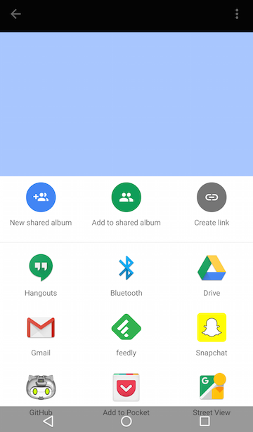
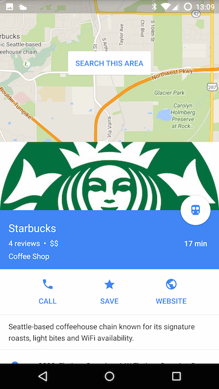
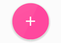

# Android Material Design Component
*A list of Android Material Design Components and how apps can use them.*
## Table of Contents

  1. [What is Material Design?](#what-is-material-design)
  1. [Material Design Components](#material-design-components)
  1. [Dialog](#dialog)
  1. [Picker](#picker)
  1. [Nav Drawer](#nav-drawer)
  1. [Right Drawer](#right-drawer)
  1. [Bottom Sheet](#bottom-sheet)
  1. [Floating Action Button (FAB)](#floating-action-button-fab)
  1. [Sub Menu](#sub-menu)
  1. [Menu](#menu)
  1. [Lists](#lists)
  1. [Card](#card)
  1. [Raised Button](#raised-button)
  1. [Snackbar](#snackbar)
  1. [App Bar](#app-bar)
  1. [Toolbar](#toolbar)
  1. [Refresh Indicator](#refresh-indicator-for-swipe-to-refreshpulldown-to-refresh)
  1. [Search Bar / Quick Entry](#search-bar--quick-entry)
  1. [Switch](#switch)
  1. [References](#references)

## What is Material Design?
> Material design is a comprehensive design language and guidelines developed by Google that makes use of elements from print design, responsive transitions, and depth effects.

## Material Design Components


## Dialog
  
  <a name="dialog-description"></a><a name="dialog-description"></a>
  - [**Description**:](#dialog-description)
  A dialogs is small window that communicates additional information to the user and requires the user to take action (e.g., accept or cancel).
    Android features a number of different dialogs that are subclasses of the base class _android.app.Dialog_: _AlertDialog, AppCompatDialog, CharacterPickerDialog, MediaRouteChooserDialog, Presentation, AlertDialog, MediaRouteControllerDialog,_ and _ProgressDialog_.
  
  + AlertDialog: A dialog that shows a title, up to three buttons, a list of selectable items, or a custom layout.
  <a name="dialog-screenshot"></a><a name="dialog-screenshot"></a>
  - [**Screenshot**:](#dialog-screenshot)
  
  <a name="dialog-code-example"></a><a name="dialog-code-example"></a>
  - [**Code Examples**:](#dialog-code-example)
  
  + Alert Dialog
  
  ```java
  public class MyAlertDialogFragment extends DialogFragment {
    @Override
    public Dialog onCreateDialog(Bundle savedInstanceState) {
        // 1. Instantiate an AlertDialog.Builder with its constructor
        AlertDialog.Builder builder = new AlertDialog.Builder(getActivity());
        // 2. Chain setter methods to set various regions and characteristics
        builder.setMessage(R.string.dialog_message)
               .setPositiveButton(R.string.ok_text, new DialogInterface.OnClickListener() {
                   public void onClick(DialogInterface dialog, int id) {
                       // Do the OK action here
                   }
               })
               .setNegativeButton(R.string.cancel, new DialogInterface.OnClickListener() {
                   public void onClick(DialogInterface dialog, int id) {
                       // User cancelled the dialog
                   }
               });
        // 3. Create the AlertDialog object and return it
        return builder.create();
    }
}
...
...
// 4. show the dialog
DialogFragment myAlertDialog = new MyAlertDialogFragment();
myAlertDialog.show(getSupportFragmentManager(), "alert-tag");

  ```

  - **References**
    - [Design guide](https://www.google.com/design/spec/components/dialogs.html)
    - [Developer guide](http://developer.android.com/guide/topics/ui/dialogs.html)
    - [API reference](http://developer.android.com/reference/android/app/Dialog.html)

**[:top: back to top](#table-of-contents)**
  

## Picker

  <a name="picker-description"></a><a name="picker-description"></a>
  - [**Description**:](#picker-description)
  A picker is essentially a dialog that allows the user to select a value from a pre-determined set of values. There are two types of Pickers: Date pickers and Time pickers:
  
   + DatePickerDialog: A dialog that shows a UI that allows the user to select a date.
   + TimePickerDialog: A dialog that shows a UI that allows the user to select a time.
  
  <a name="picker-screenshot"></a><a name="picker-screenshot"></a>
  - [**Screenshot**:](#picker-screenshot)
  
  <a name="picker-code-example"></a><a name="picker-code-example"></a>
  - [**Code Example**:](#picker-code-example)
  
  ```java
  public static class MyTimePickerFragment extends DialogFragment
                            implements TimePickerDialog.OnTimeSetListener {
    @Override
    public Dialog onCreateDialog(Bundle savedInstanceState) {
        // 1. Use the current time as the default values for the picker
        final Calendar c = Calendar.getInstance();
        int hour = c.get(Calendar.HOUR_OF_DAY);
        int minute = c.get(Calendar.MINUTE);

        // 2. Create a new instance of TimePickerDialog and return it
        return new TimePickerDialog(getActivity(), this, hour, minute,
                DateFormat.is24HourFormat(getActivity()));
    }

    public void onTimeSet(TimePicker view, int hourOfDay, int minute) {
        // 3. Do something with the time chosen by the user
    }
...
// 4. Show the dialog
DialogFragment myTimePicker = new MyTimePickerFragment();
myTimePicker.show(getSupportFragmentManager(), "time-picker-tag");
}
```

  
  - **References**
    - [Design guide](https://www.google.com/design/spec/components/pickers.html)
    - [Developer guide](http://developer.android.com/guide/topics/ui/controls/pickers.html)
    - [API reference](http://developer.android.com/guide/topics/ui/controls/pickers.html)

**[:top: back to top](#table-of-contents)**

## Navigation Drawer

  <a name="nav-drawer-description"></a><a name="nav-drawer-description"></a>
  - [**Description**:](#nav-drawer-description) The navigation drawer is a panel that slides from the left to the right of the screen to display the app's main navigation options.
  
  <a name="nav-drawer-screenshot"></a><a name="nav-drawer-screenshot"></a>
  - [**Screenshot**:](#nav-drawer-screenshot)
  
  <a name="nav-drawer-code-example"></a><a name="nav-drawer-code-example"></a>
  - [**Code Examples**:](#nav-drawer-code-example)
  
   - Using the DrawerLayout widget.
  
  ```xml
  <android.support.v4.widget.DrawerLayout>
      <!-- The main content view (It can be any view container) -->
      <FrameLayout/>
      <!-- The navigation drawer view -->
      <ListView />
  <android.support.v4.widget.DrawerLayout>
  ```
  
  - Using the Android Design Support Library.
  
  ```xml
  <android.support.v4.widget.DrawerLayout>
    <!-- The main content view (It can be any view container) -->
      <FrameLayout/>
    <!-- The navigation drawer view -->
    <android.support.design.widget.NavigationView
        app:menu="@menu/drawer_view"/>
  </android.support.v4.widget.DrawerLayout>
  ```
  - **References**
    - [Design guide](https://material.google.com/patterns/navigation-drawer.html)
    - [Developer guide](https://developer.android.com/training/implementing-navigation/nav-drawer.html)

**[:top: back to top](#table-of-contents)**

## Right Drawer

  <a name="right-drawer-description"></a><a name="right-drawer-description"></a>
  - [**Description**:](#right-drawer-description)
  
  <a name="right-drawer-screenshot"></a><a name="right-drawer-screenshot"></a>
  - [**Screenshot**:](#right-drawer-screenshot)
  
  <a name="right-drawer-code-example"></a><a name="right-drawer-code-example"></a>
  - [**Code Examples**:](#right-drawer-code-example)

**[:top: back to top](#table-of-contents)**

## Bottom Sheet

  <a name="modal-bottom-sheet-description"></a><a name="modal-bottom-sheet-description"></a>
  - [**Description**:](#modal-bottom-sheet-description)
  A bottom sheet is a sheet of paper that the user can slide up from the bottom of the screen to reveal more information. There are two types of bottom sheets: Modal and Persistent. Modal Bottom Sheet is an alternative to Dialogs and usually sets at a higher elevation than the app content to show content with additional links. Persistent Bottom Sheet presents additional app content and usually rests at the same elevation as the app content.
  
  <a name="modal-bottom-sheet-screenshot"></a><a name="modal-bottom-sheet-screenshot"></a>
  - [**Screenshot**:](#modal-bottom-sheet-screenshot)
  
  
  
  Modal Bottom Sheet.
  
  
  
  Persistent Bottom Sheet.
  
  <a name="modal-bottom-sheet-code-example"></a><a name="modal-bottom-sheet-code-example"></a>
  - [**Code Examples**:](#modal-bottom-sheet-code-example)
  Bottoms sheets can be implemented using the Design Support Library or a third-party library.
  
  + Using the Design Support Library 
    + Modal Bottom Sheet: Use the `android.support.design.widget.BottomSheetDialogFragment` class.
    + Persistent Bottom Sheet. Use the `android.support.design.widget.BottomSheetBehavior`
  
  For a sample app using the design support library, see [BottomSheetSample](https://github.com/NikolaDespotoski/BottomSheetSample)

  + Using 3rd party libraries:
    + [Bottomsheet by Flipboard]()
   
      ```xml
      <com.flipboard.bottomsheet.BottomSheetLayout>
         ...
      </com.flipboard.bottomsheet.BottomSheetLayout>   
      ```
    
    + [BottomSheet by soarcn]()

      ```java
      import com.cocosw.bottomsheet.BottomSheet;
    
      new BottomSheet.Builder(this).title("title")
                     .sheet(R.menu.list)
                     .listener(new DialogInterface.OnClickListener() {
                      @Override
                      public void onClick(DialogInterface dialog, int which) {
                          switch (which) {
                              case R.id.help:
                                  q.toast("Help me!");
                                  break;
                          }
                      }
                  }).show();
      ```

**[:top: back to top](#table-of-contents)**

## Floating Action Button (FAB)

  <a name="fab-description"></a><a name="fab-description"></a>
  - [**Description**:](#fab-description)
  
  <a name="fab-screenshot"></a><a name="fab-screenshot"></a>
  - [**Screenshot**:](#fab-screenshot)
  
  
  
  <a name="fab-code-example"></a><a name="fab-code-example"></a>
  - [**Code Examples**:](#fab-code-example)
  
  The FAB can be created using an ImageButton view and giving it a special __background__ image (Oval shape) and setting its __elevation__ to a desired depth.
  
  + **OPTION 1**: Creating FAB from scratch with custom drawable.
   
   ```xml
<ImageButton
    android:layout_width="56dp"
    android:layout_height="56dp"
    android:layout_margin="20dp"
    android:background="@drawable/oval_ripple_shape"
    android:src="@drawable/fab_plus"
    android:elevation="6dp"
    android:stateListAnimator="@anim/fab_raise"/>
   ```
   drawable/oval\_ripple\_shape.xml
   
   ```xml
<shape xmlns:android="http://schemas.android.com/apk/res/android"
    android:shape="oval">
    <solid android:color="?attr/colorAccent"/>
</shape>
   ```
   OR
   
   ```xml
<ripple xmlns:android="http://schemas.android.com/apk/res/android"
        android:color="?android:colorControlHighlight"
        android:shape="oval">
  <item>
    <shape android:shape="oval">
      <solid android:color="?android:colorAccent"/>
    </shape>
  </item>
</ripple>
   ```
   
 + **OPTION 2**: Using The Design Support Library.
 
 ```xml
 <android.support.design.widget.FloatingActionButton
   ... />
 ```
 
 + **OPTION 3**: Using third party libraries.
   + [FloatingActionButton By makovkastar](https://github.com/makovkastar/FloatingActionButton)
 
  ```xml
   <com.melnykov.fab.FloatingActionButton
    .... />
   ```
   + [android-floating-action-button By futuresimple](https://github.com/futuresimple/android-floating-action-button)
  
  ```xml
  <com.getbase.floatingactionbutton.FloatingActionButton
     ..../>
  ``` 
 
  <a name="fab-code-example"></a><a name="fab-code-example"></a>
  - [**Sieveable Queries**:](#fab-sieveable)

 ```shell
 http GET 'http://localhost:3000/q?queryText=MATCH app WHERE \
 <android.support.design.widget.FloatingActionButton/> \
 <date-published>(*)</date-published> \
 RETURN app, l$1 as releasedOn'
 ``` 

**[:top: back to top](#table-of-contents)**

## Motion and Scrolling effects with surfaces
  <a name="sub-menu-description"></a><a name="sub-menu-description"></a>
  - [**Description**:](#sub-menu-description)
  
  Scrolling interaction effect can change an element's width, height, and elevation. It can be used to show how an element can raise up to allow another surface to pass below it during scrolling. Several material design scrolling techniques are illustrated in the [material design guidelines](http://www.google.com/design/spec/patterns/scrolling-techniques.html). For example, using an appBar that collapses to a standard height and sticks to the top of the screen as the user scrolls. We can build this effect using the [CoordinatorLayout](https://developer.android.com/reference/android/support/design/widget/CoordinatorLayout.html), which coordinates behavior (e.g., scrolling) across its child views. 
  
  <a name="sub-menu-screenshot"></a><a name="sub-menu-screenshot"></a>
  - [**Screenshot**:](#sub-menu-screenshot)

  
  
  <a name="sub-menu-code-example"></a><a name="sub-menu-code-example"></a>
  - [**Code Examples**:](#sub-menu-code-example)
  
  ```
  <android.support.design.widget.CoordinatorLayout>
    <android.support.design.widget.AppBarLayout>
      <android.support.design.widget.CollapsingToolbarLayout
          app:layout_scrollFlags="scroll|exitUntilCollapsed">
          <android.support.v7.widget.Toolbar/>
      </android.support.design.widget.CollapsingToolbarLayout>
    </android.support.design.widget.AppBarLayout>
    <android.support.v7.widget.RecyclerView
      android:layout_behavior="@string/app_scrolling_view_behavior"/>
  </android.support.design.widget.CoordinatorLayout>
  ```

**[:top: back to top](#table-of-contents)**

## Sub Menu

  <a name="sub-menu-description"></a><a name="sub-menu-description"></a>
  - [**Description**:](#sub-menu-description)
  
  <a name="sub-menu-screenshot"></a><a name="sub-menu-screenshot"></a>
  - [**Screenshot**:](#sub-menu-screenshot)
  
  <a name="sub-menu-code-example"></a><a name="sub-menu-code-example"></a>
  - [**Code Examples**:](#sub-menu-code-example)

**[:top: back to top](#table-of-contents)**

## Menu

  <a name="menu-description"></a><a name="menu-description"></a>
  - [**Description**:](#menu-description)
  
  <a name="menu-screenshot"></a><a name="menu-screenshot"></a>
  - [**Screenshot**:](#menu-screenshot)
  
  <a name="menu-code-example"></a><a name="menu-code-example"></a>
  - [**Code Examples**:](#menu-code-example)
  
  ```xml
  ```

**[:top: back to top](#table-of-contents)**

## Lists

  <a name="menu-description"></a><a name="menu-description"></a>
  - [**Description**:](#menu-description)
  RecyclerView is a more advanced version of ListView and can be used to implement a scrollable list of items. For usage example,
  [see lists with material design style.](http://developer.android.com/training/material/lists-cards.html#RecyclerView)
  <a name="menu-screenshot"></a><a name="menu-screenshot"></a>
  - [**Screenshot**:](#menu-screenshot)
  
  <a name="menu-code-example"></a><a name="menu-code-example"></a>
  - [**Code Examples**:](#menu-code-example)

  In layout XML file:

  ```
  <android.support.v7.widget.RecyclerView
     .../>
  ```

  In code:

  ```
  class name: android.support.v7.widget.RecyclerView
  method name: setLayoutManager, setAdapter
  ```

**[:top: back to top](#table-of-contents)**


## Card

  <a name="card-description"></a><a name="card-description"></a>
  - [**Description**:](#card-description)
  
  <a name="card-screenshot"></a><a name="card-screenshot"></a>
  - [**Screenshot**:](#card-screenshot)
  
  <a name="card-code-example"></a><a name="card-code-example"></a>
  - [**Code Examples**:](#card-code-example)

A CardView with shadows and rounded corners and contains a child TextView:
  
  ```xml
  <android.support.v7.widget.CardView
      xmlns:card_view="http://schemas.android.com/apk/res-auto"
      card_view:cardElevation="4dp"
      card_view:cardCornerRadius="3dp">
      <TextView
           android:id="@+id/info_text"
           android:layout_width="match_parent"
           android:layout_height="match_parent" />
  </android.support.v7.widget.CardView>
      
  ```

**[:top: back to top](#table-of-contents)**

## Raised Button

  <a name="raised-button-description"></a><a name="raised-button-description"></a>
  - [**Description**:](#raised-button-description)
  
  <a name="raised-button-screenshot"></a><a name="raised-button-screenshot"></a>
  - [**Screenshot**:](#raised-button-screenshot)
  
  <a name="raised-button-code-example"></a><a name="raised-button-code-example"></a>
  - [**Code Examples**:](#raised-button-code-example)

**[:top: back to top](#table-of-contents)**

## Snackbar

  <a name="snackbar-description"></a><a name="snackbar-description"></a>
  - [**Description**:](#snackbar-description)
  A snackbar is similar to Toast in that they provide feedback but they have actions to allow users to interact. The official guidelines recommends using at most one action or no action.
  
  <a name="snackbar-screenshot"></a><a name="snackbar-screenshot"></a>
  - [**Screenshot**:](#snackbar-screenshot)
  
  <a name="snackbar-code-example"></a><a name="snackbar-code-example"></a>
  - [**Code Examples**:](#snackbar-code-example)
  
  __class__: android.support.design.widget.Snackbar
  __methods__: make, setAction, show
  
  ```java
  import android.support.design.widget.Snackbar;
  Snackbar.make(parentView, R.string.snackbar_text, Snackbar.LENGTH_LONG)
  .setAction("UNDO", myOnClickListener)
  .show();
  ```

**[:top: back to top](#table-of-contents)**

## App Bar

  <a name="app-bar-description"></a><a name="app-bar-description"></a>
  - [**Description**:](#app-bar-description)
  The app bar is formerly known as the action bar. It's a special kind of the more general widget called [Toolbar](http://developer.android.com/reference/android/widget/Toolbar.html). An app bar may contain on the left side (in LtR langauges) a navigation icon (hamburger icon) to open a navigation drawer or an _up arrow_  for navigating upward through the hierarchy, a title that reflects the current page, filter icon. On the right side, it may contain action icons or a menu icon.
  
  <a name="app-bar-screenshot"></a><a name="app-bar-screenshot"></a>
  - [**Screenshot**:](#app-bar-screenshot)
  
  <a name="app-bar-code-example"></a><a name="app-bar-code-example"></a>
  - [**Code Examples**:](#app-bar-code-example)

**[:top: back to top](#table-of-contents)**

## Toolbar
  <a name="search-bar-description"></a><a name="search-bar-description"></a>
  - [**Description**:](#search-bar-description)
  Toolbar is a more general form of the app bar. It may contain a navigation icon, branded logo image, title and subtitle, action items, and an action item. Toolbar provides developer with a much more control over the look and functionality.
  
  <a name="search-bar-screenshot"></a><a name="search-bar-screenshot"></a>
  - [**Screenshot**:](#search-bar-screenshot)
  
  <a name="search-bar-code-example"></a><a name="search-bar-code-example"></a>
  - [**Code Examples**:](#search-bar-code-example)
  
  ```xml
     <android.support.v7.widget.Toolbar
          android:id="@+id/toolbar"
          android:layout_width="match_parent"
          android:layout_height="wrap_content"
          app:popupTheme="@style/ThemeOverlay.AppCompat.Light"
          app:layout_collapseMode="pin" />
  ```
  ```java
    @Override
    public void onCreate(Bundle savedInstanceState) {
      final Toolbar toolbar = (Toolbar) findViewById(R.id.toolbar);
      setSupportActionBar(toolbar);
    }
  ```
  
**[:top: back to top](#table-of-contents)**


## Refresh Indicator for Swipe to Refresh/Pulldown to Refresh

  <a name="refresh-indicator-description"></a><a name="refresh-indicator-description"></a>
  - [**Description**:](#refresh-indicator-description)
  Show a refresh indicator when the users manually uses a vertical swipe gesture to refresh the content (e.g., pulling down).
  <a name="refresh-indicator-screenshot"></a><a name="refresh-indicator-screenshot"></a>
  - [**Screenshot**:](#refresh-indicator-screenshot)
  
  <a name="refresh-indicator-code-example"></a><a name="refresh-indicator-code-example"></a>
  - [**Code Examples**:](#refresh-indicator-code-example)
  You can implement the pull-down-to-refresh UI pattern by making the `SwipeRefreshLayout` the parent of `ListView`, `RecyclerView`, or `GridView`.
  
  ```xml
  <android.support.v4.widget.SwipeRefreshLayout>
     <ListView />
  </android.support.v4.widget.SwipeRefreshLayout>
  ```
**[:top: back to top](#table-of-contents)**

## Search Bar / Quick Entry

  <a name="search-bar-description"></a><a name="search-bar-description"></a>
  - [**Description**:](#search-bar-description)
  
  <a name="search-bar-screenshot"></a><a name="search-bar-screenshot"></a>
  - [**Screenshot**:](#search-bar-screenshot)
  
  <a name="search-bar-code-example"></a><a name="search-bar-code-example"></a>
  - [**Code Examples**:](#search-bar-code-example)

**[:top: back to top](#table-of-contents)**

## Switch

  <a name="switch-description"></a><a name="switch-description"></a>
  - [**Description**:](#switch-description)
  
  <a name="switch-screenshot"></a><a name="switch-screenshot"></a>
  - [**Screenshot**:](#switch-screenshot)
  
  <a name="switch-code-example"></a><a name="switch-code-example"></a>
  - [**Code Examples**:](#switch-code-example)

**[:top: back to top](#table-of-contents)**


## References

- [Google Design Guidelines, Material Design](http://www.google.com/design/spec)
- [Material Design on Android Checklist](http://android-developers.blogspot.com/2014/10/material-design-on-android-checklist.html)
